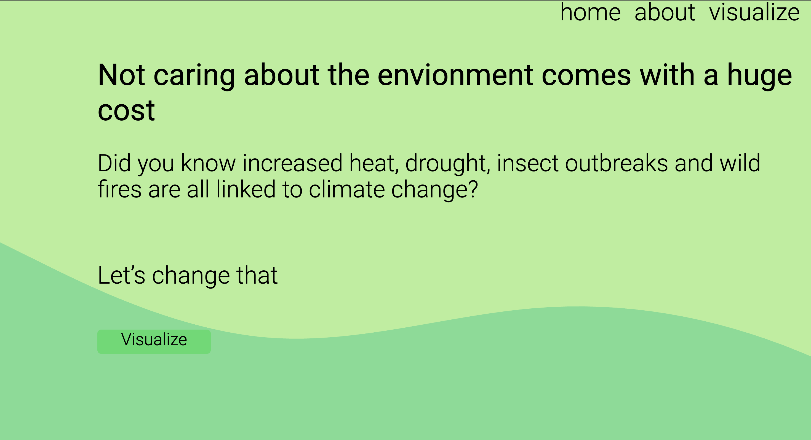
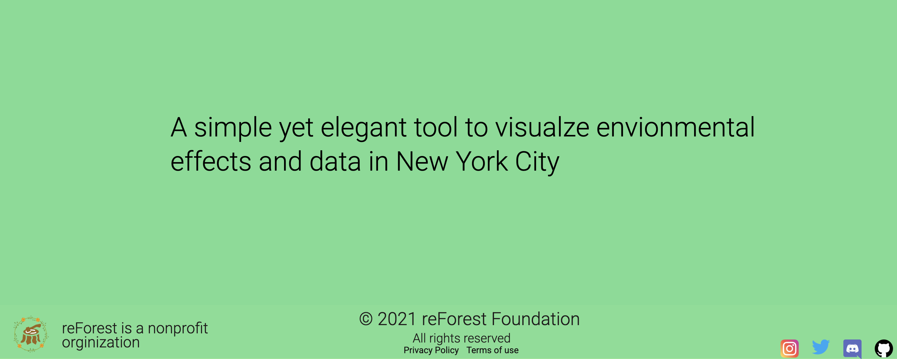

# Visualize Data in New York City 
## reForest

----------------------------------------------------------------------------------------

Features include:
 Parks
 Squirrels In Central Park
 Rats
 Reported Green House Gas Emissions
 Healthy Certfied Stores
 Botanical Gardens
 Recycling Bins
 Water Foutains
 
 Live Demo: https://youtu.be/qT91lhtMzK4 

## Preview:

 All data obtained via https://opendata.cityofnewyork.us/ 

 Utilized API to retrieve environmental data. Total of 8 datasets used. 
